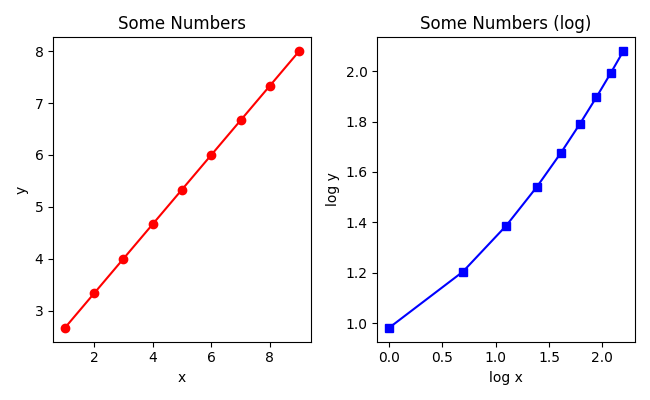
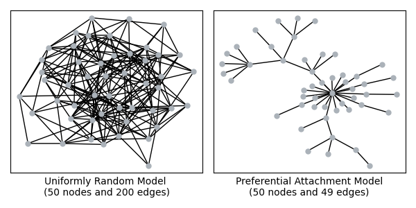

# Module 2: Interactome Properties

In this homework, you will first implement network measures and compare these measures across different yeast interactomes.  In an optional challenge, you can compare these measures across interactomes from yeast, human, and fly.  All graphs are undirected and unweighted.  

* **Assignment Out:** Monday, Sept 14
* **Assignment Due:** Monday, Sept 28

### Suggested Deadlines

The Written Assignment asks you to compare interactomes by providing figures from the last task (Task F), so it is important to work through much of this assignment in the first week of the module.  There is a lot in this assignment - make your program as complete as you can over the next two weeks.

:arrow_right: Friday, Sept 18 -- implement most of the network measures

:arrow_right: Monday, Sept 21 -- compare measures across yeast interactomes

### Tips & Info (last updated 9/22)

1. Part I of the written assignment contains the distributions for the example graphs! Take advantage of that.
2. Further, for one of the graphs the average clustering coefficient is zero across the board.  So if you're getting all zeros, it still might be correct.
3. Finally, if you get the code to be exactly the way you want it for the example graphs, make a copy of that file. **You can submit multiple files for the assignment** (e.g. `examplegraphs.py` and `yeastgraphs.py`). Once you have the example graphs working, you want to modify the copied file to handle more than two networks (see the suggestion about code structure).

## :star: **Task A**: `matplotlib` Preliminaries

`Matplotlib` is a plotting and visualization library for Python.  The `plot_graph.py` file contains a single function, which plots some numbers.  To see if you have it installed on your machine, try running `plot_graph.py`.  If it is not installed, try installing it in the same way you installed `graphspace_python`.  For example, you can open a Terminal (Mac) or Anaconda Command Prompt (for those using Anaconda as the package manager) and type:

```
pip install matplotlib
```

Remember you can preface the command with `sudo` if you get permissions errors.  Ask Anna if you have issues installing `matplotlib`.  

When you run `plot_graph.py`, a new file, `numbers.png` is created in the same directory in which you are running the code.  Opening this file shows a two-panel figure with one red curve and one blue curve:



Find the place in `plot_graph.py` where you can modify the colors, line styles, and markers.  A subset of the [colors](https://matplotlib.org/3.1.0/gallery/color/named_colors.html), [marker styles](https://matplotlib.org/3.3.1/api/markers_api.html), [line styles](https://matplotlib.org/3.2.1/gallery/lines_bars_and_markers/linestyles.html), for the `plot()` function are below.  They are passed as a single string, e.g., `'ro-'` is a red line with circle markers.  Order does not matter.

| Colors | Line Styles | Line Markers |
| -- | -- | -- |
| `r` red | `-` solid | `o` circle|
| `g` green | `--` dashed | `.` point |
| `b` blue | `-.` dash-dot | `s` square |
| `y` yellow | `:` dotted | `+` plus |
| `m` magenta | | `x` x marker |
| `c` cyan |  | `d` diamond |
| `k` black |  | `*` star|

Modify the line styles in the two subpanels.

## :star: **Task B**: Calculate and Plot Degree Distribution

Write your code in the `run.py` file, copying functions from `plot_graph.py` as necessary.  For Tasks B-E, work with the provided `graph1.txt` and `graph2.txt`, which are both files of edge lists.  Each task in B-E produces **one** figure (e.g. one `.png` file) with both lines displayed on it.  Alternatively, you can choose to make a large figure with **one** subpanel for each task.

Tasks F-G will ask you to run your code on other files of the same format, so consider this when writing your code for the earlier tasks. **Before you start each task, think carefully about what you need for the calculation and break the task down into smaller steps if necessary.**

First, write a `read_edge_file()` function that takes a filename (as a string) and returns an edge list (and any other data structures - an **adjacency list** will be useful).  For each network, print the number of nodes `n`, the number of edges `m`, and the average node degree of the network: `2m/n`.

Next, calculate and plot the degree distribution. This is a **histogram** of node degrees for each network, where the x-axis contains the degree `k` and the y-axis contains the number of nodes that have degree `k`.  Use the `plt.plot()` function from `matplotlib`, so think first about what your `x` and `y` lists should look like.  You can plot multiple lines on the same figure by calling `plt.plot()` multiple times:
```
plt.plot([1,2,3,4,5],[1,1,1,1,1],'r*')
plt.plot([1,1,1,1,1],[1,2,3,4,5],'-b')
```

_Code Structure Suggestion 1_:

You will be running the same functions on multiple files and plotting all data on the same figure, so think about how your program will be structured.  You may want to keep a list of the file names and the dataset names that you can iterate over, e.g.,

```
def main():
  names = ['Graph1','Graph2']
  files = ['graph1.txt','graph2.txt']

  for i in range(len(names)):
    print('DATASET:',names[i])
    print('READING FILE:',files[i])
    ...

```

_Code Structure Suggestion 2_:

You will be calculating histograms for many of these tasks.  For each measure, suppose you have a dictionary of (key,value) pairs where the keys are the nodes and the values are the statistic (here, degree distribution of that node).  You can write a `generate_hist()` function to take a dictionary like this and returns the lists `x` and `y` that are passed to `plt.plot()` functions.

:question: The two randomly-generated graphs look like the following. Unsure if your code is working for Tasks B-E?  The solution for the example graphs is shown in the Written Assignment.



## :star: **Task C**: Calculate and Plot (Average) Average Neighbor Degree

First, compute the average neighbor degree (AND) for each node :


where  is the degree of node  and  is the set of 's neighbors.

Next, plot the **average** AND for each degree `k`. The x-axis contains the degree `k` and the y-axis contains the average AND value for all nodes with degree `k`.  There should be a single y-value for each x-value plotted.

## :star: **Task D**: Calculate and Plot (Average) Clustering Coefficient

First, compute the clustering coefficient (CC) for each node :


where  is the degree of node  and  is the number of edges between 's neighbors.

:question: What happens when a node has degree 1?  The denominator becomes 0, and the clustering coefficient is undefined! In this case, set CC to 0.  Since we're working with edge lists, there will never be a node degree 0.

Next, plot the **average** CC for each degree `k`. The x-axis contains the degree `k` and the y-axis contains the average CC value for all nodes with degree `k`.  There should be a single y-value for each x-value plotted.

## :star: **Task E**: Calculate and Plot Shortest Path Length Distribution

:arrow_right: In [Lab 3](https://github.com/Reed-CompBio/BIO331-F20-Lab3-shortest-paths), you will implement the algorithm for computing the shortest paths from a node `v` to all other nodes in an undirected, unweighted graph.  Use the Lab 3 code for this task.

Calculate the shortest path lengths between all pairs of nodes in each network, and plot a histogram of these path lengths.  The x-axis contains the path length `l` and the y-axis contains the number of node pairs that are connected by a path of length `l`.  Note that in this histogram we are counting _pairs_ of nodes, rather than nodes.

:question: What happens if two nodes are not connected?  Their distance is infinite! Ignore these node pairs in your counts.

## :star: **Task F**: Compare Measures Across Yeast interactomes

For the next two tasks, you will generate figures for different groups of interactomes.  Your code should be able to reproduce the figures for the example graphs, and the yeast graphs by uncommenting certain lines in your program. Add comments that describe how to run all three examples.

Generate the plots in Tasks B-E for the following five yeast networks.  The first three networks are from the Yu et al. paper we discussed in class, and two networks from the more recent BioGRID database.
- `Yeast_Y2H_Union.txt` - union of three screens from Yu et al.
- `Yeast_Combined_APMS.txt` - co-complex membership interactions from Yu et al.
- `Yeast_LC_Multiple.txt` - literature-curated interactions from Yu et al.
- `BioGRID_Y2H.txt` - all unique two-hybrid interactions reported in BioGRID.
- `BioGRID_APMS.txt` - all unique affinity capture-MS interactions reported in BioGRID.

These and all networks are available in the [Bio331 Dataset GitHub Repo](https://github.com/Reed-CompBio/BIO331-F20-Datasets/tree/master/yeast-interactomes). Download these interactomes and place them in the same directory as your code.

Next, modify your code to generate statistics from Tasks B-E and generate the relevant figures. Remember to keep your code to run the example graphs around (comment it out), and refer to _Code Structure Suggestion 1_ for ideas to structure your code.

:question: Do your plots look all scrunched up?  That's because one of the datasets is much larger than the others. Try changing the x-axis limit with the following command (which restricts the range to be from 0-150):
```
plt.xlim([0,150])
```

:question: Does your degree distribution look similar across all networks? Try plotting the log-transformed plot. Look to the code in `plot_graph.py` for details.

:question: Your code may take a few minutes to run (the Shortest Paths for all node pairs is time-intensive).  If your code takes more than 10 minutes to run, you can drop plotting this curve for the BioGRID datasets.  See the optional task below for another way to get around this issue.

## **Optional**: Compare Measures Across Yeast, Human, and Fly interactomes

While this part is optional, you now have all the code to compare interactomes across species.  Generate the plots in Tasks B-E for the following three networks.  These networks are all available in the Dataset GitHub Repo, in the locations linked below.
- [`BioGRID_physical.txt`](https://github.com/Reed-CompBio/BIO331-F20-Datasets/tree/master/yeast-interactomes) - all unique yeast physical interactions reported in BioGRID.
- [`Human_HIPPIE.txt`](https://github.com/Reed-CompBio/BIO331-F20-Datasets/tree/master/human-interactomes) - a human interactome (from the [HIPPIE Database](http://cbdm-01.zdv.uni-mainz.de/~mschaefer/hippie/))
- [`Fly.txt`](https://github.com/Reed-CompBio/BIO331-F20-Datasets/tree/master/fly-interactomes) - a fly interactome generated by Anna and Derek for this class's project.

Download these interactomes and place them in the same directory as your code. Modify your code to generate statistics from Tasks B-D and generate the relevant figures.

:question: Task E, computing path lengths for all nodes, may take a long time for large networks. You do not need to complete Task E for this comparison.  However, if you do, you can calculate the histogram of the first 100,000 paths for every network to get a sense of the differences.

## Submitting

:star2: **You're Done with Tasks A-F!** You just need to submit your python code (not the network or figure files).  Before you submit `run.py` via Moodle, look through the comments and add any additional ones that explain what your code does.  Include comments that describe how to run all parts of the code. Code organization and clarity will contribute few points in grading.

### Instructions for resubmitting

As described on the [syllabus](https://www.reed.edu/biology/courses/bio331/files/syllabus.pdf), there is no penalty for re-submitting this assignment as long as you follow the instructions below. All resubmissions are due by Finals Week - ask Anna if you have any questions.

* You submit whatever you have by the deadline.
* You add a comment to the top of your code indicating that you plan to resubmit this assignment (e.g. "I plan to resubmit this assignment.")
* You schedule a meeting with Anna within one week of the deadline to make a plan.
